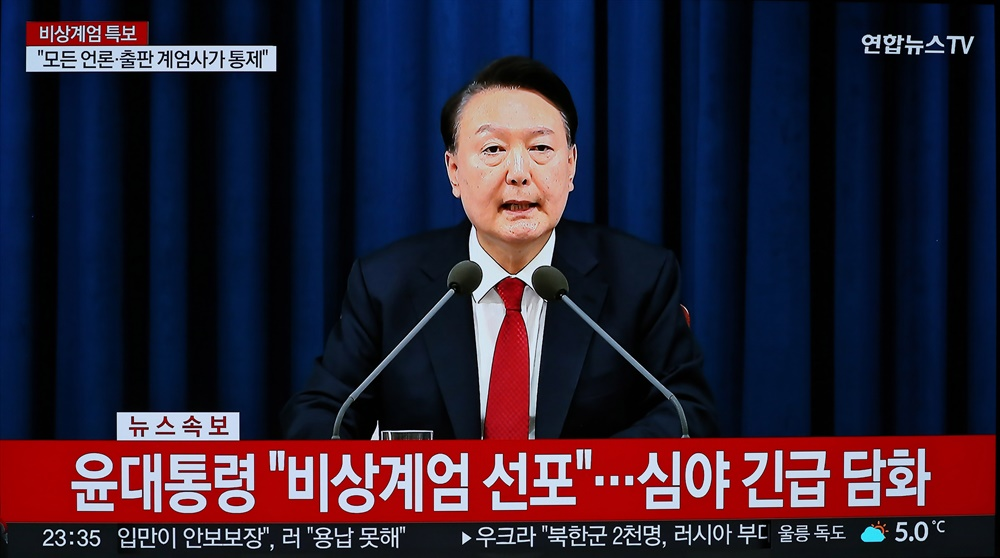
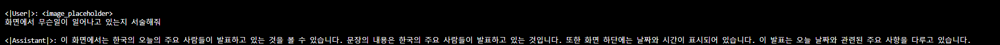
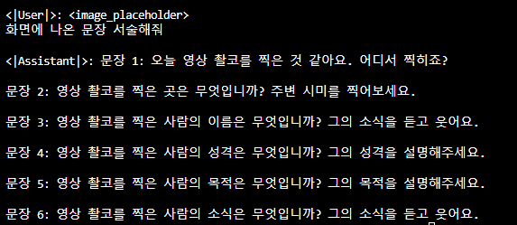
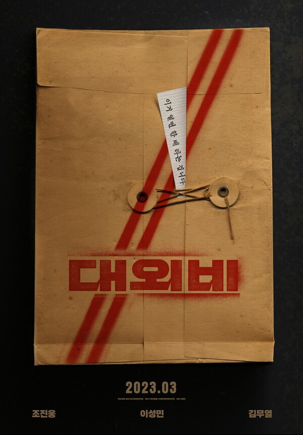
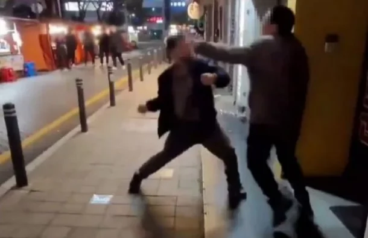
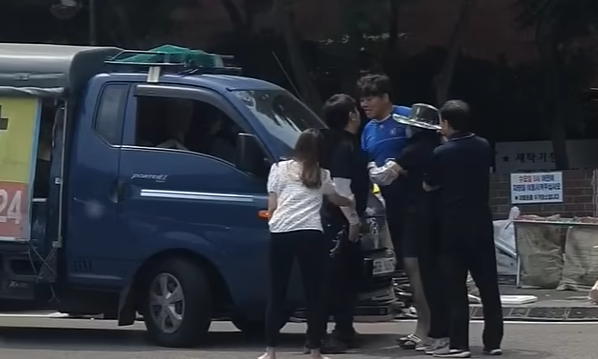

# A study on DEEP SEEK - JANUS for DOMESTIC PURPOSE

# 통합 비교/분석: Janus, Janus-Pro, JanusFlow, VL2

---

## 1. Janus vs. Janus-Flow vs. Janus-Pro vs. VL2 (학습 차이 중심 비교)

아래 표는 앞서 다뤘던 “학습 차이” 관점에서 네 모델을 비교한 예시입니다.  
(근거는 Janus 계열 논문 ①, ②, ③ 및 VL2 관련 공개 문서를 가정하여 작성.)

|                          | **Janus**                                                                                                                       | **Janus-Flow**                                                                                                                                 | **Janus-Pro**                                                                                                                    | **VL2**                                                                                                                                           |
|:------------------------:|:--------------------------------------------------------------------------------------------------------------------------------:|:----------------------------------------------------------------------------------------------------------------------------------------------:|:---------------------------------------------------------------------------------------------------------------------------------:|:-------------------------------------------------------------------------------------------------------------------------------------------------:|
| **핵심 목적**            | 멀티모달 **이해(Understanding)** + **생성(Generation)**를 통합<br>VQ(오토회귀) 기반 이미지 생성                                                                       | 분리 인코더 구조를 유지하되, **Rectified Flow** 방식으로 이미지 생성<br>(AR + Flow 결합)                                                        | Janus 대비 (1) 학습 전략 최적화, (2) 대규모 데이터 추가, (3) 더 큰 모델(1B/7B)로 확장<br>짧은 프롬프트 생성 안정성 강화 및 성능 향상                | 오직 **이미지(문서) 이해**에 특화된 **전문가 혼합(MoE)** 구조<br>이미지 생성 기능 없음                                                            |
| **학습 전략**            | 1) 사전학습: 언어 모델(LLM) 고정 + 어댑터·인코더만 갱신<br>2) 멀티모달 프리트레이닝(이해+생성 혼합 데이터)<br>3) 지도 파인튜닝(Instruction) | 1) **Stage 1**: 무작위 초기화 모듈 적응<br>2) **Stage 2**: AR+Flow 통합 프리트레이닝<br>3) **Stage 3**: Instruction Tuning (분리 인코더 & Flow 정착) | Janus의 3단계 학습 틀(사전학습→프리트레이닝→파인튜닝) 유지<br>단, (a) 합성 미학 데이터(1:1) 추가<br>(b) ImageNet 활용 비중 축소<br>(c) 모델 사이즈 확장 | **MoE** 아키텍처로, 다수 ‘전문가(Expert)’ 모듈에 대해<br>모듈 별 파인튜닝 → 라우터(Router)가 입력에 따라 적절히 전문가를 배정                   |
| **데이터세트 종류**      | 텍스트(영·중심) + 기본 이미지 캡션<br>VQA, 캡셔닝, 텍스트→이미지 등                                                               | Rectified Flow 훈련용 **노이즈→이미지** 데이터 +<br>분리 인코더(이해)용 일반 VQA/캡션 데이터                                                    | Janus 대비 대규모 합성 데이터 투입(7천만 건 수준)<br>→ 실제:합성 1:1 비율로 품질↑, 짧은 프롬프트 안정↑                                              | 주로 **OCR, 문서·차트, 다중 이미지 분석** 등<br>이미지 해석용 데이터 위주: 문서 스캔, 차트/표, VQA, 문맥 이미지                                       |
| **모델 구조**            | 단일 트랜스포머 + 분리 인코더(이해 Enc, 생성 Enc)<br>이미지 생성은 VQ 토큰 AR                                                      | 분리 인코더 유지 + **Rectified Flow**(연속 벡터장) 방식 도입<br>AR 토큰 대신, 노이즈를 점진적으로 업데이트                                      | Janus 구조(분리 인코더, AR 생성)는 동일<br>모델 크기 1B·7B 확장 + 어댑터/디퓨전 모듈 최적화                                                        | **MoE** (스파스 모델): OCR·VQA·차트 전문가 등<br>서로 다른 전문 모듈 결합, 필요한 것만 활성화                                                     |
| **이미지 생성 여부**     | **가능** (오토회귀 VQ, 품질은 중간 수준)<br>짧은 프롬프트 안정성 낮음                                                             | **가능** (Flow 기반, 품질·속도 모두 우수)<br>표현 정렬(Representation Alignment)으로 이해 능력도↑                                               | **가능** (오토회귀+디퓨전 결합, Janus 대비 품질↑)<br>짧은 프롬프트에서도 안정적                                                                   | **불가능** (이미지 생성은 지원 안 함)<br>문서·차트 등 시각 정보 이해/분석에 특화                                                                  |
| **한국어 지원**          | 매우 제한적<br>(거의 영·중심, 한국어는 일부 데이터만)                                                                             | 기본적으로 Janus와 비슷<br>(Rectified Flow 자체는 언어 의존도 낮지만 텍스트-이미지 데이터는 영·중심)                                             | 동일하게 영·중심, 짧은 프롬프트에서 한글은 종종 출력 에러 발생<br>(합성 데이터 다수도 영문 위주)                                                   | OCR로 간판·문서 스캔 등 한국어 인식 가능<br>텍스트 생성 능력은 제한적                                                                             |
| **활용 분야**            | 멀티모달 챗봇, 간단한 이미지 QA & 생성                                                                                           | 고품질 이미지 생성 (Flow) + 이해 (분리 인코더)<br>창의성 및 안정성↑                                                                                | 디자인, 예술적 콘텐츠 생성, 멀티모달 비서<br>Janus 대비 품질 및 안정성 대폭 상승                                                                  | 문서 분석, 차트 해석, OCR, 자율주행 시각 인식 등<br>**이미지 이해/분석 중심** (생성은 제공 X)                                                     |
| **주요 장점**            | 구조 단순, 경량 모델(1B~1.3B급)로도 통합 멀티모달 가능                                                                             | Flow 방식으로 “연속공간에서 이미지 생성”<br>품질·속도 우수, 분리 인코더로 이해력 보존                                                             | 대규모 데이터/모델로 짧은 프롬프트 불안정성 해결<br>멀티모달 이해 및 생성 스코어 모두 업                                                           | 문자 인식, 문서 이해, 차트 분석 등 정밀한 시각 분석에 탁월<br>(고해상도 이미지를 동적 타일링 처리)                                                |
| **주요 단점**            | 모델 초창기 버전이라<br>짧은 프롬프트 이미지 품질 불안정                                                                           | 설계와 학습 파이프라인 복잡 (AR + Flow 병행)<br>Rectified Flow 계열 연구 지식 필요                                                                 | 모델 사이즈가 커짐에 따른 학습 자원·추론 비용 증가<br>실제 파인튜닝 시 합성 데이터 양도 매우 큼                                                   | 이미지 생성 불가능<br>AR/Diffusion 기반 창의적 출력은 불가                                                                                       |

> **Note**: Janus, Janus-Pro, JanusFlow 관련 내용은 ①, ②, ③ 세 논문에서 발췌했으며, VL2 부분은 DeepSeek 측이 공개한 별도 기술 자료(가상의 예시)를 참조했습니다.

---

## 2. (A안) 점진적 발전 관점 테이블

아래 표는 **Janus → Janus-Pro → JanusFlow**가 모두 한 계보로 **순차 발전**한 것처럼 바라본 예시입니다.  
(실제 논문상으로는 JanusFlow가 별도 갈래라는 뉘앙스가 더 강함에 유의하세요.)

| **버전**        | **추가/변경점**                                                                                             | **핵심 개선 효과**                                                      | **주요 근거**                                                 |
|:---------------:|:-----------------------------------------------------------------------------------------------------------:|:-----------------------------------------------------------------------:|:-------------------------------------------------------------:|
| **Janus**       | - 최초로 “시각 인코더 분리(Decouple) 구조” 제안 <br>(이해 Enc + 생성 Enc)<br>- 오토회귀(VQ) 기반 이미지 생성 | - 이해/생성 간 표현 충돌 완화<br>- 멀티모달 이해 성능 및<br>기본적 이미지 생성 지원  | (① 3장 2절, p.4, 14~18줄)<br>“…decouples visual encoding…”     |
| **Janus-Pro**   | - 학습 전략 최적화 (ImageNet/합성 데이터 비율 조정 등)<br>- 데이터셋 규모 대폭 확장<br>- 모델 파라미터 1B/7B로 스케일업 | - 짧은 프롬프트에서도 생성 품질 안정<br>- 시각 이해 성능 +10%p 이상 향상<br>- 텍스트→이미지 지표 고득점         | (② 2장 2절, p.3, 30~36줄)<br>“…incorporate approx. 72M synthetic data…” |
| **JanusFlow**   | - 오토회귀 대신 **Rectified Flow** 생성 결합<br>- 분리 인코더 구조 유지 + “표현 정렬(Representation Alignment)” 기법 추가 | - 이미지 생성 속도/품질/안정성 향상<br>- 분리 인코더로 이해력 유지하며 Flow 기반 추론 | (③ 3장, p.3, 9~14줄)<br>“…unified multimodal model that integrates rectified flow…” |

> 실제로 JanusFlow는 Janus-Pro를 잇는 후속이라기보다는 **‘Janus 기반 다른 계열’**에 가깝습니다.

---

## 3. (B안) 별도 라인 관점 테이블

이번에는 **Janus-Pro**와 **JanusFlow**를 **서로 다른 갈래**로 본다는 관점에서,  
각각 Janus를 어떻게 계승하고 어디서 차별화되는지 간단히 대조합니다.

|                       | **Janus-Pro**                                                                                                                        | **JanusFlow**                                                                                                                                                     |
|:---------------------:|:------------------------------------------------------------------------------------------------------------------------------------:|:-----------------------------------------------------------------------------------------------------------------------------------------------------------------:|
| **기반**             | Janus(①)에서 **“분리형 인코딩 + 오토회귀 생성”** 골격 계승                                                                             | Janus(①)의 **“분리형 인코딩”**만 계승,<br>생성부는 **Rectified Flow**(연속공간 벡터장) 방식으로 설계                                                                 |
| **주요 개선점**       | 1) **훈련 전략 최적화** (합성 미학 데이터 1:1 비율 등)<br>2) **모델 스케일 업**(1B/7B)<br>3) **짧은 프롬프트 안정화**                                                         | 1) **오토회귀+Flow** 융합으로 텍스트→이미지<br>2) **표현 정렬(Representation Alignment)** 기법 추가<br>3) 분리 인코더 구조 유지                                   |
| **결과적 특징**       | - 생성 안정성·품질 향상<br>- 멀티모달 이해 성능 대폭 개선 (MMBench, GQA 등)<br>- AR 기반 이미지 생성 (Diffusion 첨가)                                                        | - Flow 기반 연속적 생성으로 “속도/품질/안정성” 확보<br>- 멀티모달 이해도 우수<br>- 오토회귀 토큰 예측 대신, **노이즈→이미지 변환** 단계를 LLM이 지시               |
| **논문 직접 인용 예시** | (② Janus-Pro) 1장 (p.2, 2~4줄)<br>*“…an enhanced version of Janus that incorporates improvements across three dimensions…”*                                                | (③ JanusFlow) 3장 (p.3, 9~14줄)<br>*“…unified multimodal model that seamlessly integrates rectified flow… Unlike purely autoregressive token generation…”*        |

---

## 4. 논문에서의 근거 (원문+해석, 페이지∙줄 정보)

여기서는 Janus 계열 3편의 논문(①, ②, ③)에서 핵심 발췌문을 예시로 들어둡니다.

### (1) **Janus**의 “시각 인코더 분리” 근거
- **위치**: ① [Janus] 3장 2절 (p.4) 14~18줄  
- **원문**:  
  > “...we propose Janus, a unified multimodal framework that decouples visual encoding for multimodal understanding and generation. Specifically, we introduce two independent visual encoding pathways...”
- **한글 해석**:  
  > “...우리는 Janus라는 통합 멀티모달 프레임워크를 제안하며, 멀티모달 이해와 생성에서 시각 인코딩을 분리한다. 구체적으로, 이해와 생성을 담당하는 두 개의 독립 인코딩 경로를 도입한다...”

### (2) **Janus-Pro**가 Janus를 확장한 후속 모델임
- **위치**: ② [Janus-Pro] 1장 (p.2) 2~4줄  
- **원문**:  
  > “...we introduce Janus-Pro, an enhanced version of Janus that incorporates improvements across three dimensions: training strategies, data, and model size...”
- **한글 해석**:  
  > “...이 논문에서는 Janus를 확장한 버전인 Janus-Pro를 소개한다. 학습전략, 데이터, 모델 규모라는 세 가지 측면에서 개선이 이뤄졌다...”

### (3) **JanusFlow**에서 Rectified Flow를 결합한 별도 계열임
- **위치**: ③ [JanusFlow] 3장 (p.3) 9~14줄  
- **원문**:  
  > “...we propose JanusFlow, a powerful unified multimodal model that seamlessly integrates rectified flow with the LLM architecture. Unlike purely autoregressive token generation, rectified flow draws continuous velocity fields from noise to image in an iterative manner...”
- **한글 해석**:  
  > “...LLM 구조에 Rectified Flow를 자연스럽게 결합한 강력한 통합 멀티모달 모델 JanusFlow를 제안한다. 순수 오토회귀 토큰 생성과 달리, Rectified Flow는 노이즈에서 이미지로 가는 연속적 벡터장을 반복적으로 추론한다...”

### (4) JanusFlow가 Janus의 “분리 인코더” 아이디어를 채택
- **위치**: ③ [JanusFlow] 3장 1절 (p.4) 13~17줄  
- **원문**:  
  > “...unlike the single-encoder design in prior unified frameworks, we adopt the decoupled vision encoders proposed in Janus [xx], ensuring that the demands of high-level semantic reasoning and low-level pixel generation can be met simultaneously...”
- **한글 해석**:  
  > “...기존 통합 모델들이 단일 인코더 설계를 택했던 것과 달리, 우리는 Janus [xx]에서 제안한 분리된 시각 인코더(Decoupled Vision Encoders)를 채택해, 고수준 의미 추론과 저수준 픽셀 생성을 동시에 충족시키도록 했다...”

---

### 최종 정리

- **Janus**: 멀티모달 이해와 생성을 통합하되, 시각 인코더를 분리함으로써 **오토회귀 기반** 모델임에도 이해/생성 충돌을 완화한 초기 모델.  
- **Janus-Pro**: Janus의 “분리형 인코더 + AR 생성” 구조를 더 큰 모델(1B, 7B) 및 추가 데이터(합성 미학)로 확장, 짧은 프롬프트 생성 안정성과 이해 성능을 크게 높인 **직계 후속**.  
- **JanusFlow**: Janus에서 도입된 “분리형 인코더” 아이디어를 계승하되, **Rectified Flow**를 통한 이미지 생성 메커니즘으로 완전히 갈아탄 **평행 확장 모델**.  
- **VL2**: 별도의 **MoE 기반 시각-언어 이해** 모델로, 이미지 생성 기능은 없지만 정밀한 OCR∙문서∙차트 분석 등에 강점.  

이처럼 Janus-Pro는 Janus를 직접 계승한 발전 모델이고, JanusFlow는 같은 ‘분리 인코더’ 개념을 활용한 **별도 라인**에 더 가깝습니다. VL2는 비전-언어 이해 특화로 “이미지 생성” 대신 **문서·차트·OCR** 등 고정밀 시각 분석에 탁월한 전문가 혼합(MoE) 모델입니다.

# Experiments & visual Comparison

## PRO



<|User|>: <image_placeholder>
화면에서 무슨일이 일어나고 있는지 서술해줘

<|Assistant|>: 이 화면에서는 한국의 오늘의 주요 사람들이 발표하고 있는 것을 볼 수 있습니다. 문장의 내용은 한국의 주요 사람들이 발표하고 있는 것입니다. 또한 화면 하단에는 날짜와 시간이 표시되어 있습니다. 이 발표는 오늘 날짜와 관련된 주요 사항을 다루고 있습니다.

---
<|User|>: <image_placeholder>
Identify key objects and people in the image, including their count, positions, actions, and appearances.

<|Assistant|>: The image shows a person standing behind a podium with microphones, likely delivering a speech or statement. The person is dressed in a dark suit with a white shirt and red tie. The background consists of a blue curtain.

Key objects and people:
1. Person: 1 individual standing behind the podium.
2. Podium: 1 podium with microphones.
3. Microphones: 2 microphones positioned in front of the person.
4. Blue curtain: 1 curtain in the background.

The text in the image is in Korean and includes:
- A red banner at the bottom with white text.
- A small text box on the left side with additional information.
- A temperature display on the bottom right corner.

The text on the red banner reads:
"오늘 발표 내용 '미시간 체계 조직 조사' 드리 오... 조선인민군 조장 김일성 동영상 출력"

The small text box on the left side reads:
"오늘 발표 내용 '미시간 체계 조직 조사' 드리 오... 조선인민군 조장 김일성 동영상 출력"

The temperature display shows:
"23.3°C"

The non-English characters in the image are:
- 오늘 발표 내용 '미시간 체계 조직 조사' 드리 오... 조선인민군 조장 김일성 동영상 출력
- 오늘 발표 내


---

## flow

```
<|User|>: <image_placeholder>
화면에서 무슨일이 일어나고 있는지 서술해줘

<|Assistant|>:  화면에서 무슨일이 일어나고 있는지 서술해 보려면 다음과 같이 이야기를 다 해 보입니다.

1. **화면 상단 영역**: 화면 상단 영역에는 화면이 표시되고, 화면 중앙에는 화면 종료 버튼이 표시되어 있습니다.

2. **화면 좌속 영역**: 화면 좌속 영역에는 화면이 표시되고, 화면 좌속 영역에는 화면 좌속 영역에는 화면이 표시되고, 화면 좌속 영역에는 화면이 표시되고, 화면 좌속 영역에는 화면이 표시되고, 화면 좌속 영역에는 화면이 표시되고, 화면 좌속 영역에는 화면이 표시되고, 화면 좌속 영역에는 화면이 표
```
```
<|User|>: <image_placeholder>
Identify key objects and people in the image, including their count, positions, actions, and appearances.

<|Assistant|>:  The image features a man in a suit and red tie, standing behind a microphone, with a blue curtain in the background.
```


---



<|User|>: <image_placeholder>
화면에서 무슨일이 일어나고 있는지 서술해줘

<|Assistant|>: 화면에 표시된 이미지는 영화 "시네랜트" (Soneunttu)의 화면을 보여주고 있습니다. 이 이미지는 영화의 화면 영상을 보여주고 있으며, 영화의 시작 날짜와 제목을 표시합니다.

1. 시작 날짜와 제목: 영화 "시네랜트"의 시작 날짜는 2023년 3월 3일입니다. 이 날짜와 제목은 영화의 오리엔테이션으로 표시되어 있습니다.
2. 화면 영상: 이미지는 영화의 화면 영상을 보여주고 있습니다. 영상의 주요 요소들을 보여주고 있습니다.
3. 영상 표시: 영상 화면에는 영화의 주요 레이블이 표시되어 있습니다. 이미지의 중앙에는 영화 제목이 표시되어 있

---

<|User|>: <image_placeholder>
Identify key objects and people in the image, including their count, positions, actions, and appearances.

<|Assistant|>: The image contains the following key objects and people:

1. **Envelope**:
   - Position: Center of the image.
   - Appearance: Brown, sealed with two circular seals and a red diagonal stripe.
   - Actions: Sealed and appears to be a document or package.

2. **Seals**:
   - Position: Two circular seals on the envelope.
   - Appearance: Black and metallic.
   - Actions: Securing the envelope.

3. **Paper Strip**:
   - Position: Attached to the envelope.
   - Appearance: White with black text.
   - Actions: Writing or labeling the envelope.

4. **Text**:
   - Position: Various locations on the image.
   - Appearance: Black and white.
   - Content:
     - On the paper strip: "오늘의 메시지" (Today's Message).
     - At the bottom: "2023.03" (March 2023).
     - On the left: "오늘의 메시지" (Today's Message).
     - On the right: "오늘의 메시지" (Today's Message).

5. **Background**:
   - Position: Dark, likely black.
   - Appearance: Solid color.
   - Actions: Provides contrast to the central objects.

6. **Additional Text**:
   - Position: Bottom corners.
   - Content: "오늘의 메시지" (Today's Message) in both English and Korean.

The image appears to be a stylized representation of a sealed document or package, possibly related to a movie or event, given the date and text.


## Flow
```
<|User|>: <image_placeholder>
Identify key objects and people in the image, including their count, positions, actions, and appearances.

<|Assistant|>:  The image features a brown paper envelope with red stripes and a white label with Korean text. The envelope is sealed with a string and a metal clasp. The Korean text on the label reads "주소 주정하세요" which translates to "Please specify the address." The date "2023.03" is displayed at the bottom of the image.
```
```
<|User|>: <image_placeholder>
화면에서 무슨일이 일어나고 있는지 서술해줘

<|Assistant|>:  이 화면은 빛나는 비디오 판링이미지입니다. 화면 중앙에는 빨간색 빛이 뒷뒤오고 있으며, 빛이 뒤뒤오는 비디오 판링이며, 빛이 뒤뒤오는 비디오 판링이며, 빛이 뒤뒤오는 비디오 판링이며, 빛이 뒤뒤오는 비디오 판링이며, 빛이 뒤뒤오는 비디오 판링이며, 빛이 뒤뒤오는 비디오 판링이며, 빛이 뒤뒤오는 비디오 판링이며, 빛이 뒤뒤오는 비디오 판링이며, 빛이 뒤뒤오는 비디오 판링이며, 빛이 뒤뒤오는 비디오 판링이며, 빛이 뒤뒤오는 비디오 판링이며, 빛이 뒤뒤
```


---


<|User|>: <image_placeholder>
화면에서 무슨일이 일어나고 있는지 서술해줘

<|Assistant|>: 화면에 보이는 것은 두 명의 사람이 충돌하고 있는 상황입니다. 두 사람은 충돌 중에서 두 번째 사람은 첫 번째 사람에게 무장을 던진 것 같습니다. 첫 번째 사람은 두 번째 사람에게 무장을 반견하고 있습니다. 이 중간에 두 사람은 주변 사람과 거리를 두고 있습니다. 주변 사람들은 이 중간에 두 사람의 충돌에 대해 관심을 가지고 있습니다. 이 상황은 주로 충돌 중에서 무장을 던진 사람이 죄송하거나 문제 해결을 시작할 수 있는 상황입니다.

---


<|User|>: <image_placeholder>
Identify key objects and people in the image, including their count, positions, actions, and appearances.

<|Assistant|>: The image shows two people engaged in a physical altercation on a sidewalk. Key objects and people in the image include:

1. **Two People**:
   - The person on the left is wearing a dark jacket and pants, and appears to be in a defensive stance with one leg forward and arms up.
   - The person on the right is wearing a light-colored jacket and dark pants, and is in an attacking stance with one arm extended towards the other person.

2. **Location**:
   - The scene takes place on a sidewalk next to a street.
   - There are bollards along the sidewalk, and a yellow line separates the sidewalk from the street.
   - In the background, there are several people standing and observing the altercation.

3. **Additional Details**:
   - The sidewalk is tiled, and there is a piece of paper or a small object on the ground near the two people.
   - The area appears to be urban, with buildings and streetlights visible in the background.

There are no non-English characters visible in the image.

---
## Flow
```
<|User|>: <image_placeholder>
화면에서 무슨일이 일어나고 있는지 서술해줘

<|Assistant|>:  무슨일이 일어나고 있는지는 아직 확인하지 못하는 것 같아서 무엇을 알 수 없습니다. 이 비동기 모음은 누구도 무엇인지 알 수 없습니다.
```
```
<|User|>: <image_placeholder>
Identify key objects and people in the image, including their count, positions, actions, and appearances.

<|Assistant|>:  The image shows two men, one wearing a black suit and the other wearing a gray shirt. The man in the suit is in a defensive stance, while the man in the gray shirt is pointing at him.
```




<|User|>: <image_placeholder>
화면에서 무슨일이 일어나고 있는지 서술해줘

<|Assistant|>: 이 화면에서는 두 명의 사람이 물을 주는 것을 볼 수 있습니다. 두 사람 중 한 명은 외출하는 옷입니다. 그들은 두 명의 다른 사람과 함께 있습니다. 두 명의 다른 사람은 옷을 벗어놓고 외출하는 사람과 함께 있습니다. 두 사람들은 물을 주는 것을 보고 있습니다. 물은 물풀이므로 물을 주는 사람들은 물을 주는 것입니다. 물은 물풀이므로 물을 주는 사람들은 물을 주는 것입니다. 물은 물풀이므로 물을 주는 사람들은 물을 주는 것입니다. 물은 물풀이므로 물을 주는 사람들은 물을 주는 것입니다. 물은 물풀이므로 물을 주는 사람들은 �

---

<|User|>: <image_placeholder>
Describe the overall scene, including the setting (indoor/outdoor), lighting, color tones, and atmosphere.

<|Assistant|>: The scene is set outdoors, likely on a street or sidewalk. The lighting appears to be natural daylight, suggesting it is daytime. The color tones are predominantly neutral, with the blue of the vehicle standing out against the more muted background. The atmosphere seems casual and relaxed, with people gathered around the vehicle, possibly engaged in conversation or a transaction. The setting appears to be urban, given the presence of the vehicle and the surrounding environment.

---

<|User|>: <image_placeholder>
Identify key objects and people in the image, including their count, positions, actions, and appearances.

<|Assistant|>: The image shows a group of people gathered around a blue van. Here are the key observations:

1. **People**:
   - There are five individuals visible in the image.
   - Two of them are standing near the van's open door.
   - One person is standing in front of the van, facing the group.
   - Two individuals are standing to the right of the van, engaged in conversation.

2. **Objects**:
   - A blue van with the brand "Proton" visible on the side.
   - A sign on the van with the number "24".
   - A bicycle is visible near the group.
   - A sign in the background with text in another language.

3. **Actions**:
   - The individuals appear to be engaged in conversation or interaction.
   - One person is holding a bicycle.
   - The person in front of the van seems to be interacting with the group, possibly explaining or discussing something.

4. **Appearance**:
   - The individuals are dressed in casual and semi-formal attire.
   - The van is parked on the side of the road, and the scene appears to be in an urban area.

The image captures a moment of interaction among a group of people near a parked vehicle.


## Flow
```
<|User|>: <image_placeholder>
 화면에서 무슨일이 일어나고 있는지 서술해줘

<|Assistant|>:  무슨일이 일어나고 있는지는 알 수 없습니다. 이 화면에는 몇 가지 차량이 모여서 있는 것 같아서 무슨일이 일어나고 있는지는 알 수 없습니다.
```
```
<|User|>: <image_placeholder>
Identify key objects and people in the image, including their count, positions, actions, and appearances.

<|Assistant|>:  There are five people in the image, with one person standing near the van, two people standing in the middle, and two people standing on the right side. The van is blue and parked on the street.
```
## basic model

CUDA 버전으로 인해 기본 모델 실험 불가 (2025.03.19)

flash_attn 이라는 라이브러리 활용함